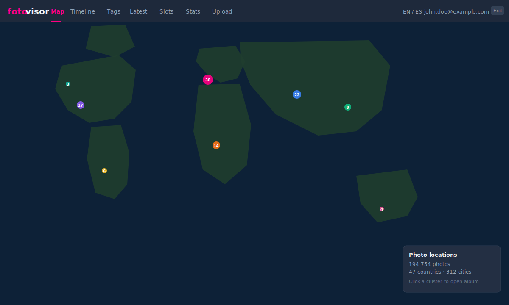
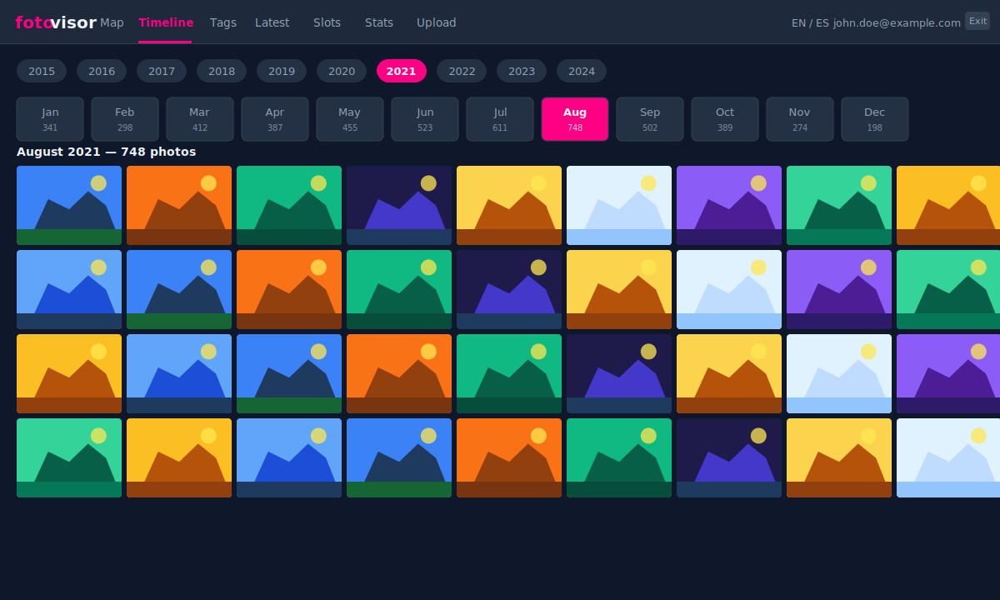
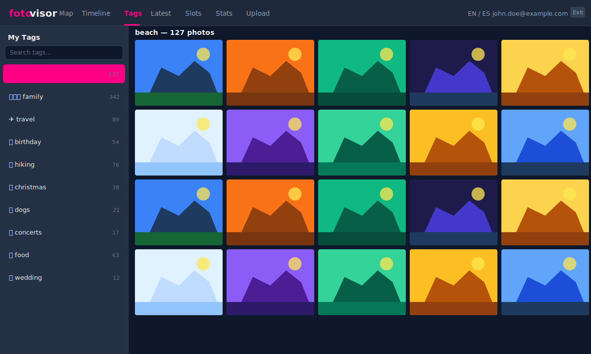
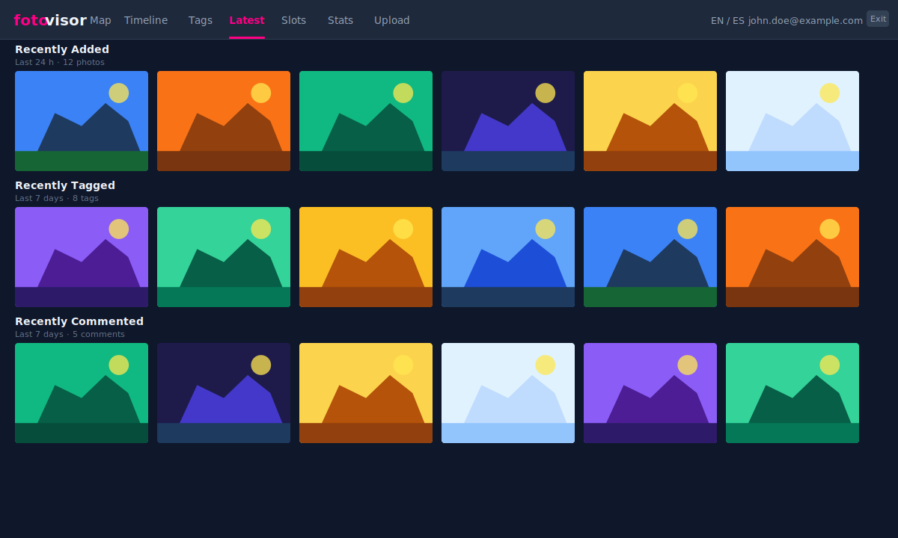
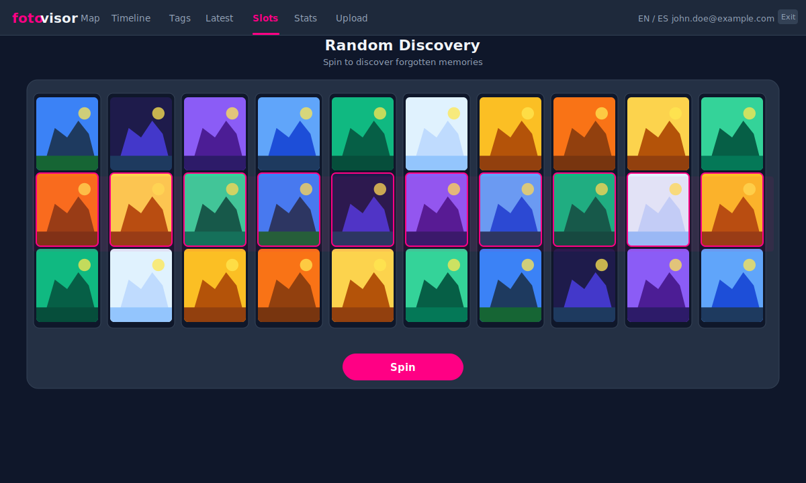
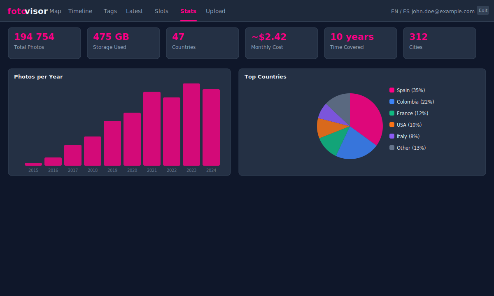
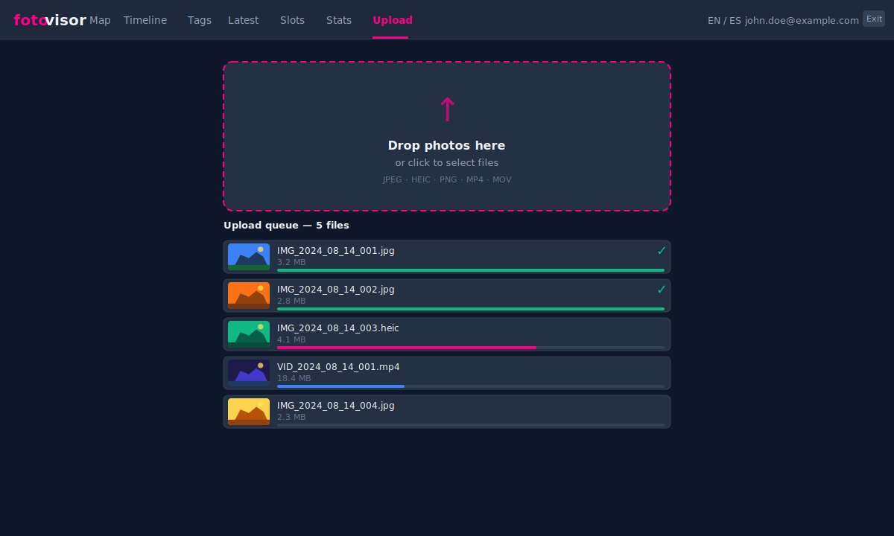
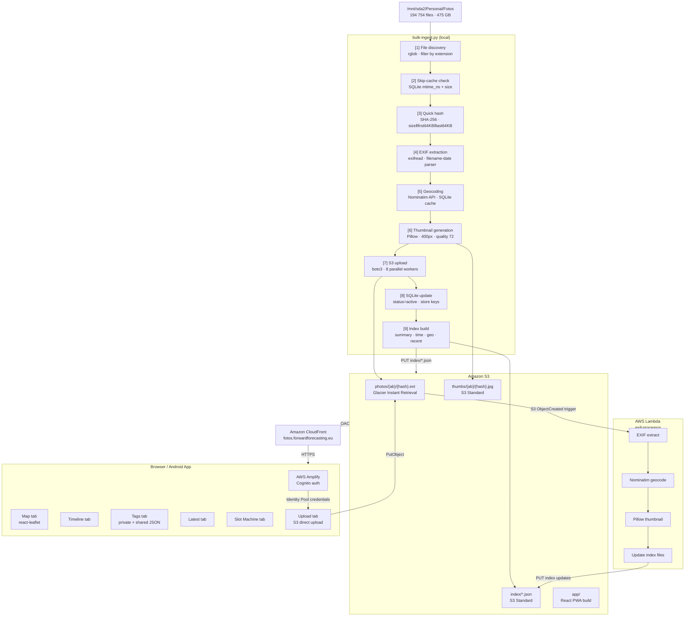
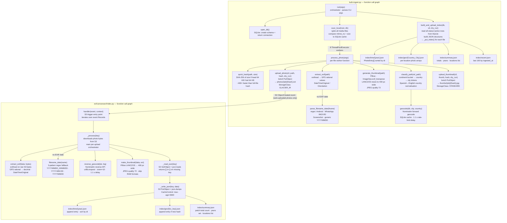

# 📷 Photo Visor

A personal family photo viewer hosted on AWS — exploring 194 000+ photos across a world map and timeline with tagging, commenting, direct upload, and a slot-machine random-discovery mode. The architecture is fully serverless and database-free: originals live in S3 Glacier Instant Retrieval, thumbnails and pre-computed JSON indexes are delivered via CloudFront, and an AWS Lambda handles EXIF processing for newly uploaded photos. A React 18 PWA serves the browser frontend; an Android app is available via Google Play Internal Testing.

**Main technologies:** React 18 + TypeScript + Vite (PWA) · AWS S3 (Glacier IR + Standard) · Amazon CloudFront · AWS Cognito · AWS Lambda (Python) · AWS CDK (TypeScript, infrastructure-as-code) · Leaflet + react-leaflet (world map) · Capacitor 6 (Android) · Pillow + exifread (EXIF processing)

**Monthly cost:** ~$2–3/month. Full breakdown in [Section 7 — AWS Cost Estimation](#7-aws-cost-estimation).

---

## Table of Contents

1. [Overview](#1-overview)
2. [Architecture](#2-architecture)
3. [Data Processing Pipeline](#3-data-processing-pipeline)
4. [Libraries & Dependencies](#4-libraries--dependencies)
5. [Technologies NOT Used (and Why)](#5-technologies-not-used-and-why)
6. [Data Flow Diagram](#6-data-flow-diagram)
7. [AWS Cost Estimation](#7-aws-cost-estimation)
8. [Setup & Deployment](#8-setup--deployment)
9. [Auditing](#9-auditing)

---

## 1. Overview

| Feature | Detail |
|---|---|
| Photos | 194 754 files · 475 GB |
| Storage | S3 Glacier Instant Retrieval (originals) + S3 Standard (thumbnails & indexes) |
| Delivery | Amazon CloudFront · custom domain `fotos.forwardforecasting.eu` |
| Auth | Amazon Cognito (User Pool + Identity Pool) |
| Frontend | React 18 + TypeScript + Vite + PWA |
| Mobile | Android via Capacitor 6 (Google Play Internal Testing) |
| Monthly cost | ~$2–3 USD |

Key user-facing tabs:

- **Map** — photos plotted on a Leaflet world map by GPS / folder geocoding
- **Timeline** — photos browsed by year → month
- **Tags** — per-user private tags with optional family sharing
- **Latest** — recently added photos, newest tags, newest comments
- **Slot Machine** — random photo discovery (10 reels, slot-machine animation)
- **Upload** — owner-only direct upload to S3 with EXIF processing

---

### Screenshots

All images below use placeholder photos — no personal content is included.

**🗺 Map** — photos plotted on a world map; clusters show photo count per region

<p align="center"></p>

**📅 Timeline** — browse by year → month → photo grid

<p align="center"></p>

**🏷 Tags** — private tags with photo grid; tags can optionally be shared with family

<p align="center"></p>

**🆕 Latest** — recently added, recently tagged, and recently commented photos

<p align="center"></p>

**🎰 Slots** — slot-machine random discovery; 10 reels each show a random photo

<p align="center"></p>

**📊 Stats** — summary cards, photos-per-year bar chart, and top-countries breakdown

<p align="center"></p>

**⬆ Upload** *(owner only)* — drag-and-drop upload with per-file progress; Lambda processes EXIF on arrival

<p align="center"></p>

---

## 2. Architecture

```
┌────────────────────────────────────────────────────────────────────┐
│  Local machine                                                     │
│  /mnt/sda2/Personal/Fotos  (475 GB, 194 754 files)                │
│                                                                    │
│  bulk-ingest.py  ──────────────────────────────────────────────►  │
└───────────────────────────────────────────────────────────────┬───┘
                                                                │  boto3 (S3 PutObject)
                                                                ▼
┌───────────────────────────────────────────────────────────────────┐
│  Amazon S3  (photo-visor-295936871972)                            │
│                                                                   │
│  photos/{ab}/{hash}.jpg   ← S3 Glacier Instant Retrieval         │
│  thumbs/{ab}/{hash}.jpg   ← S3 Standard                          │
│  index/summary.json       ← S3 Standard                          │
│  index/time/{year}.json   ← S3 Standard                          │
│  index/geo/{folder}.json  ← S3 Standard                          │
│  index/tags/{user}.json   ← S3 Standard (per-user private tags)  │
│  index/tags/shared.json   ← S3 Standard (family-shared tags)     │
│  index/recent.json        ← S3 Standard (last 100 ingested)      │
│  index/private.json       ← S3 Standard (privacy overrides)      │
│  app/                     ← React PWA build                      │
└───────────────────────────┬───────────────────────────────────────┘
                            │  Origin Access Control (OAC)
                            ▼
┌───────────────────────────────────────────────────────────────────┐
│  Amazon CloudFront  (fotos.forwardforecasting.eu)                 │
│  ACM certificate (us-east-1)                                      │
└───────────────────────────┬───────────────────────────────────────┘
                            │  HTTPS
                            ▼
┌───────────────────────────────────────────────────────────────────┐
│  Browser / Android App                                            │
│  React SPA  ──  AWS Amplify (Cognito auth)                        │
│              ──  AWS SDK v3 (S3 direct upload)                    │
│              ──  CloudFront fetch (index JSON, thumbnails)        │
└───────────────────────────────────────────────────────────────────┘
                            │  S3 trigger (new upload)
                            ▼
┌───────────────────────────────────────────────────────────────────┐
│  AWS Lambda  (photo-visor-exif-processor)                         │
│  Python · Pillow · exifread · Nominatim                           │
│  Updates index files in S3 for newly uploaded photos              │
└───────────────────────────────────────────────────────────────────┘
```

### Infrastructure-as-Code

All AWS resources are defined in **AWS CDK (TypeScript)** under `infra/`. A single `cdk deploy` provisions:

- S3 bucket with lifecycle rules (Glacier Instant Retrieval for `photos/*`)
- CloudFront distribution with OAC, custom domain, and ACM certificate
- Cognito User Pool + Identity Pool (Amplify auth)
- Lambda for post-upload EXIF processing

---

## 3. Data Processing Pipeline

### 3.1 Bulk Ingest (`scripts/bulk-ingest.py`)

The ingest script runs locally and processes all photos from the source folder tree. It is idempotent: re-runs skip unchanged files.

```
Source folder
    │
    ▼
[1] File discovery  ──  rglob over IMAGE_EXTS / VIDEO_EXTS
    │
    ▼
[2] Skip-cache check  ──  compare (path, size, mtime_ns) against SQLite DB
    │                     unchanged files reuse stored hash (no I/O)
    ▼
[3] Quick hash  ──  SHA-256 of (8-byte size ‖ first 64 KB ‖ last 64 KB)
    │               stable across renames and folder moves
    ▼
[4] EXIF extraction  ──  exifread reads GPS tags, DateTimeOriginal
    │                    Fallback: parse datetime from filename pattern
    │                    (WhatsApp "IMG-20191019-WA0041.jpg",
    │                     Android  "20180904_120522.jpg", etc.)
    ▼
[5] Folder classification  ──  heuristic: continent buckets → country → city
    │                          Nominatim reverse-geocode for GPS-tagged photos
    │                          Nominatim forward-geocode for folder city names
    │                          SQLite geocoding cache (1.1 s rate limit)
    ▼
[6] Thumbnail generation  ──  Pillow: 400 px wide, JPEG quality 72, EXIF-aware
    │                          HEIC/HEIF support via pillow-heif (optional)
    ▼
[7] S3 upload  ──  original → photos/{ab}/{hash}.ext  (Glacier Instant)
    │              thumbnail → thumbs/{ab}/{hash}.jpg  (Standard)
    │              Parallel upload with ThreadPoolExecutor (8 workers)
    ▼
[8] SQLite state update  ──  marks photo as 'active', stores geo/datetime/keys
    │
    ▼
[9] Index build  ──  reads all 'active' photos from SQLite
    │                generates JSON files and uploads to S3:
    │                  • index/summary.json      (totals, years, locations)
    │                  • index/time/{year}.json  (flat PhotoEntry[] per year)
    │                  • index/geo/{folder}.json (photos per location album)
    │                  • index/recent.json       (last 100 by ingested_at)
```

### 3.2 Lambda EXIF Processor (`lambdas/exif-processor/`)

Triggered by S3 `ObjectCreated` events on `photos/*`. Performs the same EXIF → geocoding → thumbnail → index-update pipeline for photos uploaded directly through the web app (owner upload tab).

### 3.3 Photo Identity

Photos are identified by a **quick hash** — SHA-256 of `8-byte file size ‖ first 64 KB ‖ last 64 KB`. This is ~400× faster than hashing the full file and has negligible collision probability for photographic content. The hash remains stable even if the file is moved or renamed, enabling change-tracking across incremental re-runs.

### 3.4 Datetime Recovery

20 196 photos had no EXIF datetime. A filename parser recovered 13 679 of them using patterns such as:

| Pattern | Example |
|---|---|
| Android camera | `20180904_120522.jpg` |
| WhatsApp image | `IMG-20191019-WA0041.jpg` |
| WhatsApp video | `VID-20200315-WA0002.mp4` |
| Screenshot | `Screenshot_2021-03-14-09-45-20.png` |

### 3.5 Geocoding

Geographic coordinates are resolved in two ways:
1. **EXIF GPS tags** → Nominatim reverse-geocode → city + country
2. **Folder name** → heuristic city/country token extraction → Nominatim forward-geocode

Results are cached in SQLite to respect the OSM fair-use policy (1.1 s delay between API calls).

---

## 4. Libraries & Dependencies

### Python (ingest script & Lambda)

| Library | Purpose |
|---|---|
| **boto3** | AWS SDK for Python. Uploads photos, thumbnails, and index JSON files to S3; reads/writes index files from Lambda. |
| **Pillow (PIL)** | Image processing library. Generates 400 px JPEG thumbnails with EXIF-aware auto-rotation (`ImageOps.exif_transpose`). Also reads basic image dimensions. |
| **pillow-heif** | Optional plugin that adds HEIC/HEIF support to Pillow (common on iPhones). Registered with `register_heif_opener()` at runtime. |
| **exifread** | Pure-Python EXIF tag reader. Extracts `GPS GPSLatitude`, `GPS GPSLongitude`, `EXIF DateTimeOriginal`, `Image Orientation`. Lower-level than Pillow's EXIF module, giving access to raw GPS rational values. |
| **requests** | HTTP client used to call the Nominatim (OpenStreetMap) geocoding API. Includes `User-Agent` header per OSM fair-use policy. |
| **tqdm** | Terminal progress bars with ETA, rate, and total counts for the multi-step ingest pipeline. |
| **sqlite3** | Python standard library. Maintains `state.db`: tracks every photo's hash, S3 keys, datetime, geo coordinates, upload status, and mtime cache to avoid re-hashing unchanged files. |
| **hashlib** | Python standard library. Used for the quick-hash SHA-256 fingerprint. |
| **concurrent.futures** | Python standard library. `ThreadPoolExecutor` with 8 workers parallelises the S3 upload step. |
| **pathlib** | Python standard library. All file-system operations use `Path` objects for portability. |

### TypeScript / JavaScript (frontend)

| Library | Purpose |
|---|---|
| **React 18** | UI component framework. Context API manages global state (language, privacy, tags). |
| **TypeScript** | Static typing across the entire frontend. |
| **Vite 5** | Build tool and dev server. Produces the optimised PWA bundle. |
| **AWS Amplify v6** | Cognito authentication. Provides `Authenticator` UI component, `getCurrentUser`, `fetchAuthSession`. |
| **AWS SDK v3 (`@aws-sdk/client-s3`)** | Used client-side (with Cognito Identity Pool credentials) for direct S3 uploads from the browser and for writing per-user tag/comment JSON files. |
| **react-leaflet + leaflet** | Interactive world map. Photos are clustered by location using `leaflet.markercluster`. |
| **vite-plugin-pwa** | Generates Service Worker and Web App Manifest for offline capability and "Add to Home Screen". Uses Workbox under the hood (CacheFirst for thumbnails, NetworkFirst for index files). |
| **Capacitor 6** | Wraps the PWA in a native Android WebView for Google Play distribution. Supports Node 18 (unlike Capacitor 7 which requires Node 22). |
| **AWS CDK (TypeScript)** | Infrastructure-as-Code for all AWS resources. |

### AI / ML Technologies

**This project does not use any AI, machine learning, or generative AI technologies.** Specifically:

- No large language models (LLM) or generative AI (GenAI)
- No image classification or computer vision models
- No speech-to-text conversion
- No image diffusion models
- No chatbots or conversational AI
- No Retrieval-Augmented Generation (RAG)
- No agentic AI frameworks

The project was *developed* using Claude Code (Anthropic's AI coding assistant), but the deployed application contains no AI components.

---

## 5. Technologies NOT Used (and Why)

| Technology | Reason not used |
|---|---|
| **Kafka** | No event streaming required. The ingest pipeline runs as a local batch job; S3 events trigger Lambda directly. |
| **GraphQL** | No API server exists. All data is pre-computed JSON served as static files via CloudFront. GraphQL would add latency and cost without benefit. |
| **Kubernetes** | No containers or microservices. The backend is fully serverless (S3 + CloudFront + Lambda). |
| **FastAPI** | No REST API server. The architecture is "static-first": all index files are pre-built JSON uploaded to S3. No request-time computation is needed. |
| **PostgreSQL / any RDBMS** | A SQLite file (`state.db`) runs locally during ingest only; it is never deployed. The production system is database-free. |
| **Redis / ElastiCache** | CloudFront edge caching replaces an application cache layer. No session state is stored server-side. |

---

## 6. Data Flow Diagram

### 6.1 High-Level Architecture Flow



### 6.2 Function-Level Call Graph

Shows the actual Python functions and their call relationships in both the local ingest script and the Lambda.



---

## 7. AWS Cost Estimation

Based on actual usage: **194 754 photos · 475 GB originals · ~20 GB thumbnails · ~0.1 GB indexes**.  
Assumes a family of ~5 users browsing occasionally (~10 GB CloudFront egress/month).

### 7.1 Storage

| Service | Resource | Unit price | Quantity | Monthly |
|---|---|---|---|---|
| S3 Glacier Instant Retrieval | Photo originals | $0.004 / GB | 475 GB | **$1.90** |
| S3 Standard | Thumbnails (400 px JPEG) | $0.023 / GB | 20 GB | **$0.46** |
| S3 Standard | Index JSON + app bundle | $0.023 / GB | ~0.5 GB | **$0.01** |
| | | | **Storage subtotal** | **≈ $2.37 / month** |

### 7.2 Processing & Requests

| Service | Resource | Unit price | Quantity | Monthly |
|---|---|---|---|---|
| Lambda | EXIF processor invocations | First 1 M req free | ~100 / month | **$0.00** |
| Lambda | Compute (128 MB · ~3 s / call) | Free tier covers it | ~100 / month | **$0.00** |
| S3 Glacier IR | GET / retrieval requests | $0.01 / 1 000 GETs | ~5 000 / month | **$0.05** |
| S3 Standard | PUT requests *(ingest, one-time)* | $0.005 / 1 000 | ~200 000 total | **$1.00** *(one-time)* |
| | | | **Processing subtotal** | **≈ $0.05 / month** |

### 7.3 Connectivity

| Service | Resource | Unit price | Quantity | Monthly |
|---|---|---|---|---|
| CloudFront | Data transfer to internet | First 1 TB / month free | ~10 GB | **$0.00** |
| CloudFront | HTTPS requests | First 10 M / month free | ~100 K | **$0.00** |
| Nominatim (OSM) | Geocoding API calls | Free (fair-use) | ~1 000 one-time | **$0.00** |
| | | | **Connectivity subtotal** | **$0.00 / month** |

### 7.4 Auth & Infrastructure

| Service | Resource | Unit price | Quantity | Monthly |
|---|---|---|---|---|
| Cognito | Monthly active users | First 50 K free | ~5 users | **$0.00** |
| ACM | TLS certificate | Free with CloudFront | 1 cert | **$0.00** |
| Route 53 | DNS hosted zone | $0.50 / zone | 0 *(CNAME at registrar)* | **$0.00** |
| | | | **Auth subtotal** | **$0.00 / month** |

### 7.5 AI Services

This application uses **no AI services in production**. All geocoding is done via the free Nominatim (OpenStreetMap) API; all image processing is deterministic (Pillow). No LLM, no image classifier, no diffusion model, no chatbot, no RAG pipeline.

| Service | Usage | Monthly cost |
|---|---|---|
| Any LLM / GenAI in production | — | **$0.00** |
| Any image classification / diffusion | — | **$0.00** |
| Nominatim geocoding (OSM, free) | ~1 000 calls one-time during ingest | **$0.00** |
| **Anthropic Claude Code** *(development only)* | ~15–20 h of coding sessions | **$0.00 ongoing** |

One-time development cost using Claude Code (Claude Sonnet, billed per token): approximately **$30–60**.

### 7.6 Monthly & Annual Summary

| Category | Monthly | Annual |
|---|---|---|
| Storage | $2.37 | $28.44 |
| Processing & Requests | $0.05 | $0.60 |
| Connectivity | $0.00 | $0.00 |
| Auth & Infrastructure | $0.00 | $0.00 |
| AI Services | $0.00 | $0.00 |
| **Total ongoing** | **≈ $2.42** | **≈ $29.04** |

| One-time costs | Amount |
|---|---|
| S3 PUT requests for initial ingest (~200 K files) | ~$1.00 |
| Development with Claude Code (Anthropic) | ~$30–60 |
| **Total first-year cost** | **~$60–90** |
| **Subsequent years** | **~$29 / year** |

### Cost Scaling

| Scenario | Additional monthly cost |
|---|---|
| +100 GB new photos added | +$0.40 / month |
| Heavy browsing (100 GB CloudFront egress) | +$7.65 / month |
| 50 active users (Cognito still free tier) | +$0.00 |
| Adding an LLM feature (e.g., photo captioning) | +variable (API tokens) |

---

## 8. Setup & Deployment

### Prerequisites

- Node.js 18+, Python 3.11+, AWS CLI v2, AWS CDK v2
- AWS account with appropriate IAM permissions
- Photos at `/mnt/sda2/Personal/Fotos` (configurable in `bulk-ingest.py`)

### 1. Deploy AWS Infrastructure

```bash
cd infra
npm install
cdk bootstrap
cdk deploy
# Outputs written to ../stack-outputs.json
```

### 2. Configure Frontend

```bash
# stack-outputs.json is auto-read by src/config.ts
cd frontend
npm install
```

### 3. Run Bulk Ingest

```bash
cd scripts
pip install boto3 exifread pillow requests tqdm
python3 bulk-ingest.py --workers 8
# First run: ~24 h for 194 754 files
# Subsequent runs: minutes (skip-cache on unchanged files)
```

### 4. Build & Deploy Frontend

```bash
cd frontend
NODE_OPTIONS=--experimental-global-webcrypto npm run build
aws s3 sync dist s3://<bucket>/app/ --delete \
  --cache-control "no-cache" --exclude "*.js" --exclude "*.css"
aws s3 sync dist s3://<bucket>/app/ --delete \
  --cache-control "public, max-age=31536000, immutable" \
  --exclude "*" --include "*.js" --include "*.css"
aws cloudfront create-invalidation \
  --distribution-id <id> --paths "/app/*"
```

### 5. Android Build (optional)

```bash
cd frontend
npm run build
npx cap sync android
npx cap open android
# Build release APK in Android Studio
```

### Environment / Secrets

No secrets are committed. The only configuration is `stack-outputs.json` (CDK outputs) and `src/config.ts` (reads from stack outputs). AWS credentials are managed via IAM roles and the standard AWS credential chain.

---

## 9. Auditing

This section provides a structured checklist for review by an IT expert and a cloud-architecture / data-management subject-matter expert.

### Audit Items

- **Cost & resource minimization** — ~$2–3/month, dominated by S3 Glacier Instant Retrieval for 475 GB of photo originals ($1.90/month). CloudFront delivery and Lambda EXIF processing remain within AWS free tiers. Cost is well-optimized for the data volume.
- **IT architecture** — Fully serverless and database-free in production. CDK IaC provisions all resources reproducibly. Pre-computed JSON indexes eliminate query-time compute. CloudFront OAC enforces that S3 is never directly accessible. Architecture is appropriate and well-sized for a family photo viewer.
- **Code efficiency** — Quick-hash (8-byte size ‖ first 64 KB ‖ last 64 KB) is ~400× faster than full-file SHA-256 with negligible collision probability for photographic content. Parallel S3 uploads via `ThreadPoolExecutor` (8 workers). Incremental ingest skips unchanged files using SQLite `mtime_ns` + size cache.
- **Cybersecurity** — Cognito authentication is required for photo uploads (owner only). CloudFront OAC prevents direct S3 bucket access. No secrets are committed. Index JSON files (including `index/tags/{user}.json`) are served via CloudFront — if the URL structure is known, tag data could be read without authentication. Evaluating whether tag/comment indexes should require Cognito token validation is recommended.
- **Readability & maintainability** — Function-level Mermaid call graphs for both the ingest script and Lambda are the clearest architectural documentation in the portfolio. CDK TypeScript code is the single source of truth for infrastructure.
- **AI / ML** — No AI is used in production, which is appropriate for a photo viewer. The README explicitly notes that Claude Code was used for development only.
- **Data resilience** — 475 GB of photo originals are stored in a single S3 bucket. No S3 versioning, cross-region replication, or documented backup strategy is mentioned. Loss of the bucket (accidental deletion) would be unrecoverable.
- **Other** — Nominatim fair-use rate limit (1.1s delay) is respected. HEIC/HEIF support requires the optional `pillow-heif` package. No AWS cost alarm or budget alert is documented. Android app is in Google Play Internal Testing (not public).

### Summary Table

| Audit Item | Claude's Assessment | Human Expert Assessment |
|---|---|---|
| Cost & resource minimization | ~$2–3/month. S3 Glacier IR is the correct storage class for infrequently accessed originals. CloudFront and Lambda stay in free tier. | |
| IT architecture | Serverless + database-free design is clean and appropriately sized. CDK IaC ensures reproducibility. Pre-computed indexes avoid runtime queries. | |
| Code efficiency | Quick-hash is 400× faster than full SHA-256. Parallel uploads and incremental ingest minimize re-processing. | |
| Cybersecurity | Cognito upload auth and CloudFront OAC are correct. Tag/comment index files may be readable without auth if URL is known — review recommended. | |
| Readability & maintainability | Mermaid call graphs and CDK IaC are best-in-class for documentation and infrastructure reproducibility. | |
| AI / ML | No AI in production. Appropriate for this use case. | |
| Data resilience | No documented backup strategy for 475 GB of originals. S3 versioning or cross-region replication should be considered. | |
| Other | Nominatim rate-limit respected. No AWS budget alert documented. Android app in internal testing only. | |
